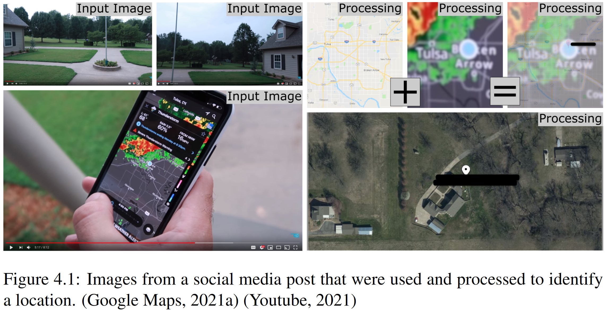
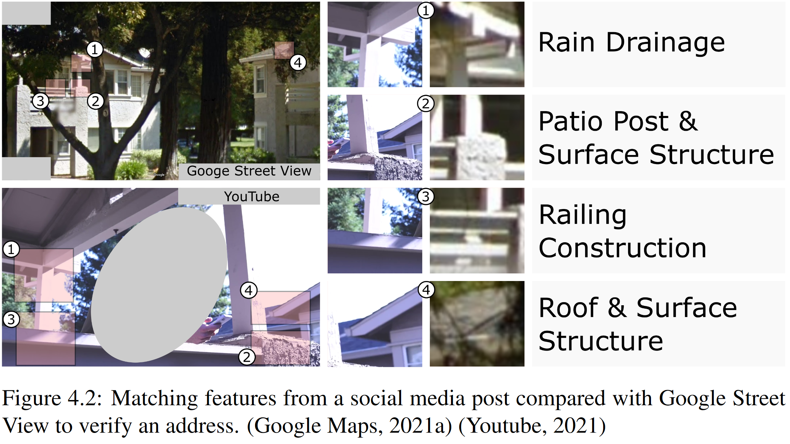
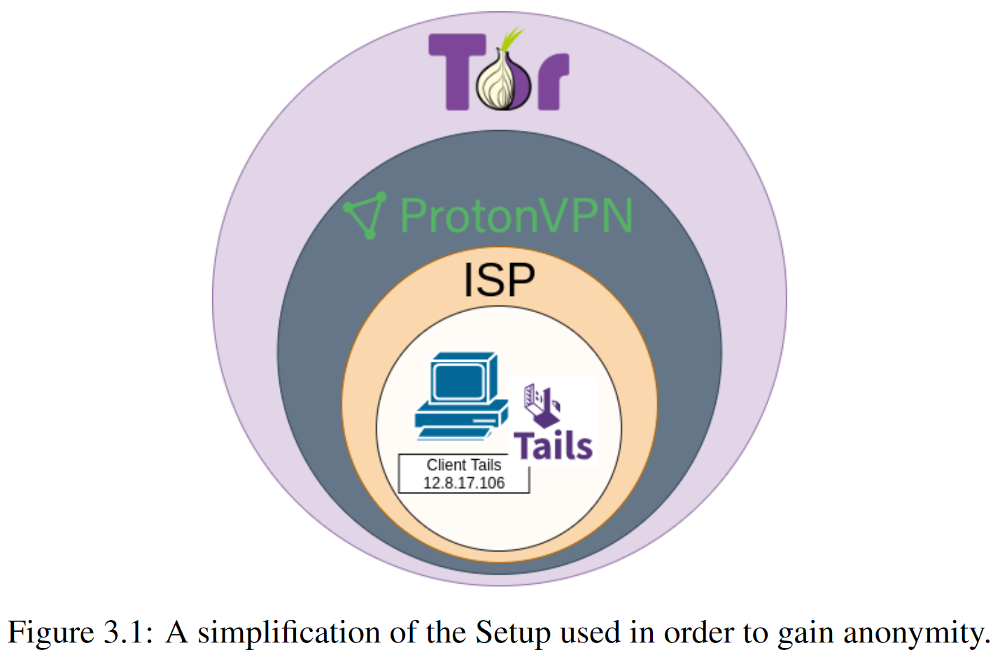
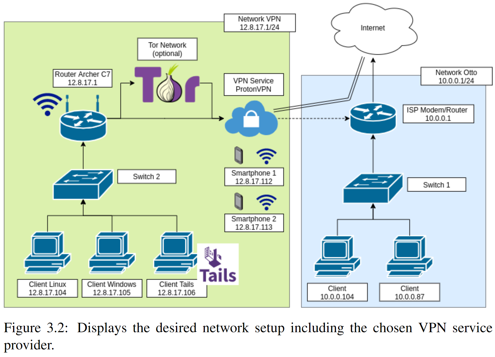

# Incidental Data: Detect and Process Personal Information from Social Media Platforms, Master Thesis, May 2021

DOI: [10.13140/RG.2.2.36286.82245](http://dx.doi.org/10.13140/RG.2.2.36286.82245)

# Abstract
Social media is often only one click away. Now more than ever, it is entangled with our everyday life. To put it another way, what happens if social media does not stop when we leave the site or delete the post we no longer want to share with the world? What if our social media posts are used unintentionally, furthermore, contain incidental data? Thus, data or information we - did not - intend to share with the world but can be found within our social media posts. What if this incidental data can be used to harm our beloved ones or ourselves?  Moreover, such data combined with publicly free available governmental databases, such as the company register, can be used to compromise privacy even further. Within this master’s thesis it was analyzed how incidental data can be found, what are the legal obligations and the monetary value behind it. Moreover, it was possible to gain interview partners such as the Criminal Intelligence Service Austria or the owner of Techlore, a company that specializes in privacy for the masses. As methodology, Open Source Intelligence Methods were used to gather incidental data. During each case, the time to search for information was limited to 2 hours. Interestingly it was possible to show that incidental data can also be found among web security experts such as Troy Hunt. With the input of such cases, an abstract fictive scenario was created to evaluate the legal implications of gathering incidental data. Further, the monetary value of incidental data using expert interviews was tried to be evaluated. In the end, the results have shown that privacy needs to be more emphasized on a governmental as well as on a private level. For this reason, a change of law is proposed as one of the results of this master’s thesis.

### Shows Process of Address Identification
  

### Shows Process of Address Verifcation

## Security Measures
1.	Avoid posting content that includes house numbers and/or street names.
2.	Be on the lookout for reflections in mirrors as well as on surfaces such as cars, windows, vitrines, glasses, sunglasses, or watches.
3.	If any, post content of vacations only afterwards.
4.	Avoid repetition of vacation respectively absent times, such as “during new years eve I am - always - on a one-week trip”.
5.	Posts should be in accordance to a single time zone regardless of a currently temporarily diverting one.
6.	Avoid posting any information from parcels or letters, such as tracking number, full address, names or QR codes.
7.	Don’t post ID’s such as driver’s license, personal ID, credit- or debit card, etcetera.
8.	Avoid posting scenes that include location-based map materials, such as navigation maps, weather- or fitness apps, et cetera.
9.	Close all curtains or post content where no windows are visible.
10.	Try tilting the camera angle as low as possible when showing the own property.
11.	Be aware that shadows or the sun’s position can also hint additional information about the location. 
12.	Don’t share fitness routes that start and/or end at your home location.
13.	Don’t share information of your own or surrounding WLAN/WiFi SSID

### Used Network Setup (Abstract)

### Used Network Setup (Detailed)

